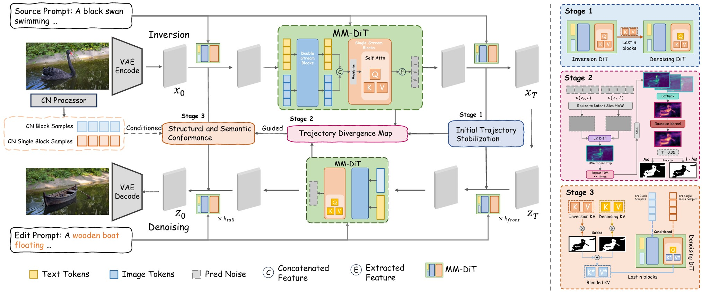

<div align="center">
  
# ✂️ Follow-Your-Shape: Shape-Aware Image Editing via Trajectory-Guided Region Control

[Zeqian Long](https://github.com/Zeqian-Long)<sup>2*</sup>, [Mingzhe Zheng](https://scholar.google.com/citations?user=U6bikksAAAAJ&hl=en)<sup>1*</sup>, [Kunyu Feng](https://github.com/fkyyyy)<sup>1*</sup>, [Xinhua Zhang](https://github.com/mayuelala/FollowYourShape), [Hongyu Liu](https://scholar.google.com/citations?user=bLRjUzAAAAAJ&hl=en)<sup>1</sup>, [Harry Yang](https://leehomyc.github.io/)<sup>1</sup>, [Qifeng Chen](https://cqf.io/)<sup>1</sup>, [Yue Ma](https://github.com/mayuelala)<sup>1</sup>,

<sup>1</sup> HKUST,  <sup>2</sup> UIUC


<a href='https://follow-your-shape.github.io/'></a>
[](https://github.com/mayuelala/FollowYourShape)
[](https://github.com/mayuelala/FollowYourShape) 
[](https://github.com/mayuelala/FollowYourShape)

<!-- [](https://paperswithcode.com/sota/text-based-image-editing-on-pie-bench?p=kv-edit-training-free-image-editing-for)
[](https://github.com/smthemex/ComfyUI_KV_Edit) -->

</div>


<p>
We propose <b>Follow-Your-Shape</b>, a training-free and mask-free framework that supports precise and controllable editing of object shapes while strictly preserving non-target content. Our method achieves superior editability and visual fidelity, particularly in tasks requiring large-scale shape replacement.
</p>


<p align="center">

</p>

# 🔥 News
<!-- - [2025.3.12] Thanks to @[smthemex](https://github.com/smthemex) for integrating KV-Edit into [ComfyUI](https://github.com/smthemex/ComfyUI_KV_Edit)!
- [2025.3.4] We update "attention scale" feature to reduce the discontinuity with the background.
- [2025.2.26] Our paper is featured in [huggingface Papers](https://huggingface.co/papers/2502.17363)! -->
- [2025.8.11] Code released!
- [2025.8.11] Paper released!
<!-- - [2025.2.25] More results can be found in our [project page](https://xilluill.github.io/projectpages/KV-Edit/)! -->

<!-- # 👨‍💻 ToDo
- ☑️ Release the gradio demo
- ☑️ Release the huggingface space for image editing
- ☑️ Release the paper -->


# 📖 Pipeline
<p>



# 🛠️ Code Setup
The environment of our code is the same as FLUX, you can refer to the [official repo](https://github.com/black-forest-labs/flux/tree/main) of FLUX, or running the following command to construct the environment.
```
conda create --n FollowYourShape python=3.10
conda activate FollowYourShape
pip install -e ".[all]"
```

We recommend you to run the experiment on a single A100 GPU.

<!-- # 🚀 Test
We have provided several scripts to reproduce the results in the paper, mainly including 3 types of editing: Stylization, Adding, Replacing. We suggest to run the experiment on a single A100 GPU. -->

<!-- ## Stylization
<table class="center">
<tr>
  <td width=10% align="center">Ref Style</td>
  <td width=30% align="center"></td>
	<td width=30% align="center"></td>
  <td width=30% align="center"></td>
</tr>
<tr>
  <td width="10%" align="center">Editing Scripts</td>
  <td width="30%" align="center"><a href="src/run_nobel_trump.sh">Trump</a></td>
  <td width="30%" align="center"><a href="src/run_art_mari.sh"> Marilyn Monroe</a></td>
  <td width="30%" align="center"><a href="src/run_cartoon_ein.sh">Einstein</a></td>
</tr>
<tr>
  <td width=10% align="center">Edtied image</td>
  <td width=30% align="center"></td>
	<td width=30% align="center"></td>
  <td width=30% align="center"></td>
</tr>

<tr>
  <td width="10%" align="center">Editing Scripts</td>
  <td width="30%" align="center"><a href="src/run_nobel_biden.sh">Biden</a></td>
  <td width="30%" align="center"><a href="src/run_art_batman.sh">Batman</a></td>
  <td width="30%" align="center"><a href="src/run_cartoon_herry.sh">Herry Potter</a></td>
</tr>
<tr>
  <td width=10% align="center">Edtied image</td>
  <td width=30% align="center"></td>
	<td width=30% align="center"></td>
  <td width=30% align="center"></td>
</tr>
</table>

## Adding & Replacing
<table class="center">
<tr>
  <td width=10% align="center">Source image</td>
  <td width=30% align="center"></td>
	<td width=30% align="center"></td>
  <td width=30% align="center"></td>
</tr>
<tr>
  <td width="10%" align="center">Editing Scripts</td>
  <td width="30%" align="center"><a href="src/run_hiking.sh">+ hiking stick</a></td>
  <td width="30%" align="center"><a href="src/run_horse.sh">horse -> camel</a></td>
  <td width="30%" align="center"><a href="src/run_boy.sh">+ dog</a></td>
</tr>
<tr>
  <td width=10% align="center">Edtied image</td>
  <td width=30% align="center"></td>
	<td width=30% align="center"></td>
  <td width=30% align="center"></td>
</tr>

</table> -->


# 🪄 Edit Your Own Image

## Toy tests
Gradio demo for image editing will be released soon. 

For now, we provide several toy test examples in `src/toy_test`.
You can either run the provided bash script directly or create your own custom bash scripts.


## Command Line
You can also run the following scripts in the terminal to edit your own image. 
```
cd src
python edit.py  --source_prompt [your source image prompt] \
                --target_prompt [your editing prompt] \
                --guidance 2 \
                --source_img_dir [the path of your source image] \
                --num_steps 15 --offload  \
                --front [typically set to 1 or 2] \
                --inject [typically set to 3 or 4] \
                --name 'flux-dev' --offload \
                --output_dir [output path] \
                --controlnet_type [specify your controlnet type] \
```

Please refer to the paper for the rationale and recommended values of the hyperparameters.


# 🖋️ Citation

If you find our work helpful, please **star 🌟** this repo and **cite 📑** our paper. Thanks for your support!

<!-- ```
@article{wang2024taming,
  title={Taming Rectified Flow for Inversion and Editing},
  author={Wang, Jiangshan and Pu, Junfu and Qi, Zhongang and Guo, Jiayi and Ma, Yue and Huang, Nisha and Chen, Yuxin and Li, Xiu and Shan, Ying},
  journal={arXiv preprint arXiv:2411.04746},
  year={2024}
}
``` -->

